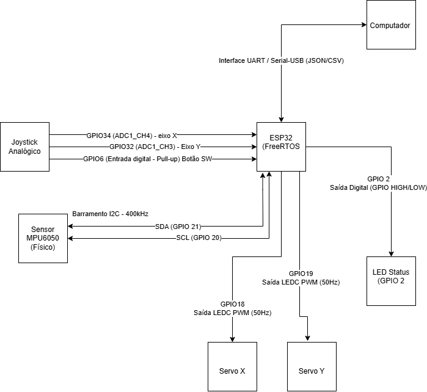

# 🕹️ Mesa Labirinto Controlada por Joystick & Gêmeo Digital no Grafana

Este repositório contém o projeto de uma **Mesa Labirinto Interativa** baseada no microcontrolador **ESP32-S3-WROOM-1U**. O sistema permite ao usuário controlar a inclinação física de um labirinto através de um joystick analógico para guiar uma esfera metálica até a saída, enquanto um sensor inercial **MPU6050 (Módulo JY62)** monitora a orientação real da mesa (ângulos de *Pitch* e *Roll*) enviando os dados em tempo real para um computador para visualização e criação de um Gêmeo Digital no **Grafana**.

# 📐 Diagrama de Blocos

---

# 📐 Diagrama Esquemático

## 📺 Demonstração em Vídeo

Confira o projeto físico funcionando na bancada e respondendo aos comandos no link abaixo:

👉 **[Assista ao Vídeo Demonstrativo no YouTube Shorts](https://youtube.com/shorts/U9YGxw62bzo?feature=share)**

---

## 🎯 Objetivos

- **Controle Preciso:** Mapear os eixos analógicos de um joystick para controlar de forma proporcional a posição de dois servomotores SG90 (Eixos X e Y).
- **Sensoriamento Inercial:** Capturar a resposta dinâmica da mesa utilizando o sensor MPU6050 (JY62) via barramento I2C.
- **Gêmeo Digital:** Transmitir via telemetria os ângulos de inclinação para uma dashboard interativa no Grafana, replicando virtualmente o comportamento mecânico da maquete.

---

## 🛠️ Hardware Utilizado & Pinagem (ESP32-S3)

Para o correto funcionamento físico e imunidade a ruídos ou conflitos com pinos reservados de gravação do ESP32-S3, a seguinte arquitetura de pinagem foi projetada no esquemático do circuito:

| Componente | Pino Componente | Pino ESP32-S3 | Função / Tipo de Sinal |
| :--- | :--- | :--- | :--- |
| **LED Status** | Anodo (+) | **GPIO 2** | Indicador de Inicialização Pronta (Saída Digital) |
| **Joystick (252B103A40TA)** | VRX (Eixo X) | **GPIO 4** | Leitura Analógica Eixo X (ADC1_CH3) |
| **Joystick (252B103A40TA)** | VRY (Eixo Y) | **GPIO 5** | Leitura Analógica Eixo Y (ADC1_CH4) |
| **Joystick (Botão SW)** | Pino 11 / SW | **GPIO 6** | Clique do Analógico (Input Pullup Digital) |
| **Servo X (Eixo X)** | PWM (Laranja) | **GPIO 18** | Controle do Servo da Base X (Saída PWM) |
| **Servo Y (Eixo Y)** | PWM (Laranja) | **GPIO 17** | Controle do Servo da Base Y (Saída PWM) |
| **MPU6050 (Módulo JY62)** | SDA | **GPIO 8** | Barramento de Dados Nativo I2C |
| **MPU6050 (Módulo JY62)** | SCL | **GPIO 9** | Barramento de Clock Nativo I2C |

> ⚠️ **Nota Elétrica Importante:** Os potenciômetros do joystick e o sensor MPU6050 operam estritamente na linha de **3.3V** regulada para proteção do conversor analógico-digital (ADC). Os dois servomotores SG90 utilizam obrigatoriamente a linha externa de **5V (VBUS/VIN)** ligada ao barramento USB para garantir o torque mecânico estável de movimentação da mesa.
> 💡 Um resistor de **330Ω** deve ser obrigatoriamente soldado em série com o ânodo do LED de Status (`GPIO 2`) para limitação de corrente.

---

## 📊 Arquitetura de Software & Integração

1. **Firmware (ESP32-S3):** Desenvolvido em C/C++, gerencia a leitura dos canais do ADC, o mapeamento linear dos valores para pulsos PWM (`0°` a `180°` nos motores) e o tratamento de registros via I2C do MPU6050.
2. **Telemetria:** Envio periódico estruturado dos ângulos de orientação empacotados via comunicação Serial/UART.
3. **Dashboard (Grafana):** Captura as strings de telemetria através de um agente de banco de dados e renderiza os eixos tridimensionais, simulando em tempo real o espelho virtual (Gêmeo Digital) da posição mecânica.

---

## 👥 Desenvolvedores (IFPB - Campus Campina Grande)

Projeto desenvolvido como avaliação final para a disciplina de **Sistemas Embarcados**, sob orientação do docente **Alexandre Sales Vasconcelos**:

- 🎓 Andreza Santos
- 🎓 Lavoisier Chaves Ramos
- 🎓 Nivaldo Neto
- 🎓 Vinícius Barbosa

---
*IFPB - Instituto Federal da Paraíba | Campus Campina Grande — Semestre 2026.1*
